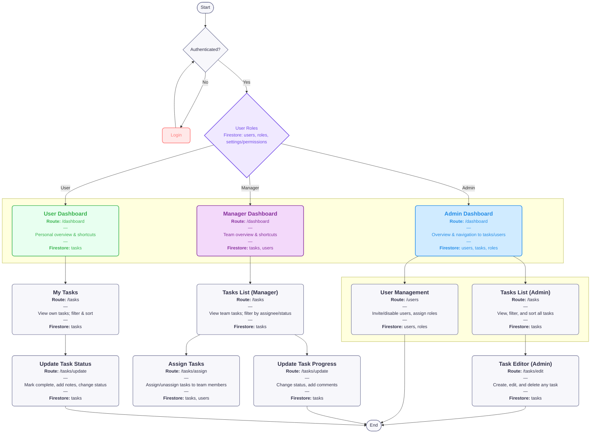

## Application Overview

This flowchart represents a role-based task management application built with Next.js and Firestore. The application uses a single shared dashboard at route `/dashboard` for all users. What each user sees and can do is determined by their `roles` and `permissions` collections. Task-related pages are unified under `/tasks`.

See the Firestore model in the data model: [Data Model](./data-model.md).

### Development principle: Unified pages, permission-driven UX

- Never build separate pages per role. Create one page per domain (e.g., `/dashboard`, `/tasks`, `/users`).
- Gate visibility and actions with permissions. The URL stays the same; the UI and capabilities change.
- Evaluate permissions on both the client (to show/hide/disable UI) and the backend/security rules (to enforce).
- Keep role metadata in `roles` and user entitlements in `permissions` and/or role grants in `users`.
- Design components to render optional modules/widgets based on permission checks; avoid branching routes.
- Favor stable deep links that work for all roles; the content adapts to the viewer.

- **Admin**: View all tasks, create/edit/delete any task, manage users.
- **Manager**: View team tasks, assign tasks to team members, update task progress.
- **User**: View own tasks and update task status.

